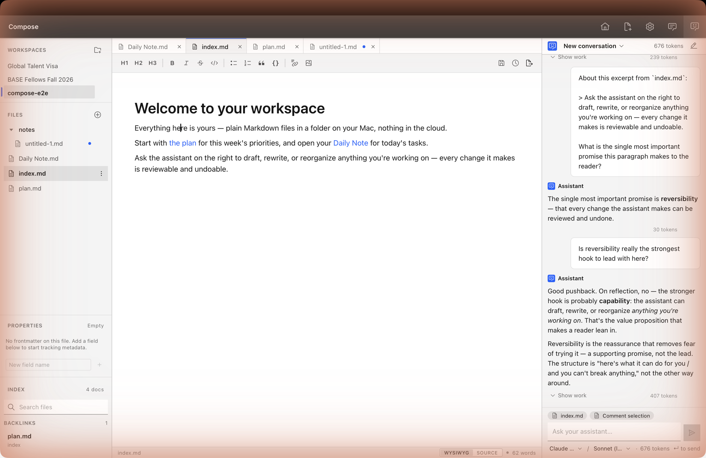

# Compose — write with AI, privately, on your own Mac

**Compose is a local-first AI writing app for macOS.** It pairs a clean, distraction‑free Markdown editor with an AI assistant that can read and rewrite your notes for you — and everything stays on your computer. No cloud, no account, no copy of your work on someone else's server.

Your documents are plain Markdown files in a folder you choose. The assistant edits *those* files directly, but every change is reviewable and undoable, so the AI can never quietly lose your work.

> **Status:** early alpha (`0.0.1-alpha.1`), macOS (Apple Silicon). [Download below.](#download)

<!-- For the best first impression, add a hero screenshot or short GIF here:
      -->

## Why Compose

- **Your files, your Mac.** Everything runs locally. Your writing never leaves your device, and it's stored as ordinary `.md` files you can open in any other app — no lock‑in, no proprietary format.
- **AI you can trust with your work.** The assistant edits your real documents, but you get a built‑in review step and a complete version history — so a bad edit is always one click from being undone.
- **Bring your own AI.** Compose drives the coding agents you already use — Claude Code, Codex, or bob — so you pick the assistant and it runs on your terms.
- **Works offline.** Open a folder and start writing. The editor needs no internet; the AI uses whatever agent you've connected.

## Features

- **Markdown editor** — write in a clean visual view or raw Markdown: headings, lists, tables, checklists, links, images, and code, with autosave as you type.
- **AI assistant** — ask it to draft, rewrite, summarize, or reorganize, and watch it work in a live chat. Stop it anytime.
- **Review & undo** — see exactly what the AI changed and accept or reject it, or let edits apply directly with automatic version history for one‑click undo.
- **Version history** — every file keeps a timeline of past versions you can restore.
- **Recoverable trash** — nothing is ever permanently deleted out from under you.
- **Search, backlinks & wiki‑links** — instant full‑text search across your whole folder, with `[[wiki‑links]]` and backlinks between notes.
- **Comments** — leave notes on any passage, and turn a comment into an AI request.
- **Beautiful export** — save any document to **PDF** or **HTML**, typeset in Computer Modern for a classic, polished look.

## Download

> ⚠️ This alpha isn't code‑signed or notarized yet, so macOS Gatekeeper will warn on first launch.

1. Download the latest `.dmg` from the [**Releases page**](https://github.com/getlatentic/compose/releases/latest).
2. Open it and drag **Compose** into your Applications folder.
3. **Right‑click Compose → Open** (not a double‑click) → **Open**. You only need to do this once.

**Requirements:** an Apple Silicon Mac (M1 or newer). For the AI features, install one agent CLI — [Claude Code](https://claude.com/claude-code), Codex, or bob — and Compose's setup will help you connect it.

## Build from source

For developers who want to run the latest from `main`:

```sh
pnpm install
pnpm tauri dev      # the full desktop app (real filesystem + AI agent)
pnpm tauri build    # a packaged .app / .dmg
```

You'll need Node + [pnpm](https://pnpm.io), Rust + the [Tauri prerequisites](https://tauri.app/start/prerequisites/), and `wasm-pack` for the search core. Compose is built with [Tauri 2](https://tauri.app) (Rust + native WebView), React + TypeScript, and [Tiptap](https://tiptap.dev)/ProseMirror.

## License

[MIT](LICENSE) © Tosin Amuda
