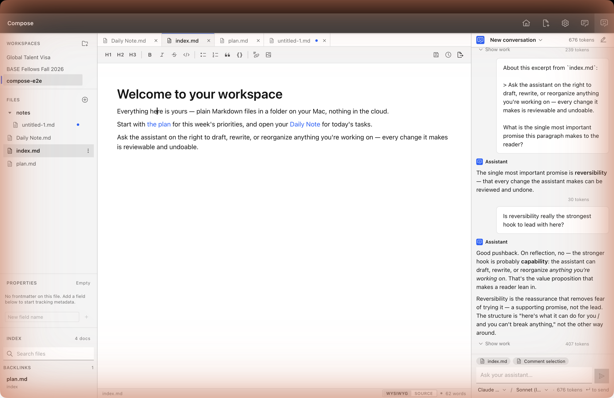

# Compose — the local-first AI Markdown editor for macOS

A local-first Markdown editor for macOS with rich editing and AI. Bring your existing harnesses like Claude Code, Codex, and Ollama to work directly in your editor.



> **Compose is currently in beta.**

## Highlights

* **Rich Markdown editing** with standard `.md` files.
* **Tables** with real cells, keyboard navigation, and row and column selection.
* **LaTeX math**, code blocks, images, lists, task lists, footnotes, and frontmatter.
* **Rich and Raw modes** for visual editing or direct Markdown.
* **Workspaces, tabs, search, wiki-links, backlinks, comments, and version history.**
* **PDF and HTML export.**
* **Bring your AI harness** with support for Claude Code, Codex, Ollama, and other agents.
* **Review and undo AI edits** before they change your documents.

AI is optional. Compose works as a full Markdown editor without it.

## Install

Download the latest macOS build from the [Releases page](https://github.com/getlatentic/compose/releases/latest).

Or install with Homebrew:

```sh
brew install --cask getlatentic/tap/compose
```

Apple Silicon and Intel are supported.

## Open from elsewhere on your Mac

Select text in any app and choose **Services → New Note in Compose** to drop it
into a new note in the active workspace.

**Share → Compose** in Safari, Photos, Notes, or any app with a Share menu files a
page, a selection, or images as a note in the workspace you pick. Clips shared
while Compose is closed wait until it opens.

Press Space on a `.md` file in the Finder and Quick Look shows the note
rendered rather than its source; its icon is a page rather than a text file.

Links open a note, so scripts, Shortcuts, and other editors can point at one:

```
compose://open?path=/Users/you/Notes/thesis/framework.md
```

The path must be inside a workspace you have opened — a link cannot reach the
rest of your disk.

## Bring your AI harness

Use the AI tools you already work with inside Compose.

Claude Code, Codex, Ollama, and other supported agents can read and edit files across your workspace while Compose provides the editor, context, review, and version history around them.

Review proposed changes before applying them, or restore an earlier version when needed.

Your documents remain ordinary Markdown files on disk.

## Build from source

Compose is built with Tauri 2, Rust, React, TypeScript, CodeMirror 6, and `@latentic/live-markdown`.

```sh
pnpm install
pnpm tauri dev
```

## License

[MIT](LICENSE) © Tosin Amuda
